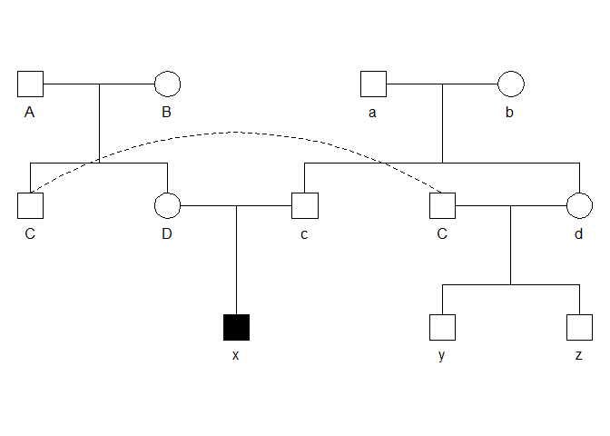

Fixing the pedigree with kinship
================
Alexandros Topaloudis

# Purpose statement

This document serves a double purpose. A log of how I manually curated
our pedigree links using genomic data and a script to replicate the
process. You require the things loaded in the following code block (3
packages) and some files all of which can be found
[here](https://github.com/topalw/pedigree) :

-   3 table files originating from a gds file *(might want to
    incorporate code here!)*

-   a total pedigree from the barn owl database

-   a metadata file with sample names and populations in the reference
    panel

``` r
library(kinship2) # pedigree making +
library(corrplot) # well....corrplots
library(knitr) # kable ! 
metadata <- read.csv('refpanel_metadata.csv')
b <- read.table('swiss_beta_matrix.table') # b-eta table of kinship
b <- b[-which(rownames(b)=='877825F2'),-which(rownames(b)=='877825F2')] #to avoid duplicated issue
rownames(b) <- metadata$NEWname[match(rownames(b),metadata$rawVCFname)]
k0 <- read.table('ref_panel_k0.table')
k1 <- read.table('ref_panel_k1.table')
p <- read.csv('total_pedigree_052022.csv') # p-edigree
dp <- read.delim('depth_stats_all.idepth') # D-epth
```

# The process

A way to start is with a comparison of the pedigree inferred kinship
matrix and the genomic kinship matrix. Intuitively the difference of
values observed for each cell should be just due to recombinational
variance from generation to generation (pedigree kinship is simply the
expected value instead of the realized Speed & Balding 2015 - Table 1).
However big deviations will be due to incorrect pedigree links or
sequencing errors. It is sometimes hard to differentiate the two but for
most cases use of multiple anchor points (comparing beta with 2-3
individuals should clarify the causes). You will see that we have both
in our dataset!

Originally, since Sonia has worked a bit on adding the hubs in the core
family pedigree I simply started from there which led to a more
complicated process. I will now attempt to redo the procedure in a
simpler manner by utilizing the pedigree - genomic comparison only. I
expect the same results.

Lets make some kinship matrices, index them and identify differences.

``` r
kp <- kinship(p$id,p$dadid,p$momid)  # swiss pedigree kinship matrix
binp <- match(rownames(b), rownames(kp)) # get index of sequenced samples in kp
kp <- kp[binp,binp] # subset pedigree matrix to include only sequenced samples 
```

Since I might want to calculate differences many times I will create a
function that does this.

``` r
# return difference matrix
diff.k <- function(mat1, mat2){
  if(setequal(rownames(mat1),rownames(mat2))){
  d1 <- as.matrix(mat1 - mat2)
  return(d1)
  }else { print('matrix missmatch')}
}
# color transparency function by Tristan
add.alpha <- function(col, alpha=1){
  if(missing(col))
    stop("Please provide a vector of colours.")
  apply(sapply(col, col2rgb)/255, 2, 
        function(x) 
          rgb(x[1], x[2], x[3], alpha=alpha))  
}
#plotting function
plot.diff <- function(d.mat,cutoff){
  #corrplot(d.mat, method='shade',type='upper',tl.pos='n',is.corr=F,diag=F)
  plot(d.mat[upper.tri(d.mat,diag=T)], pch=20, col = add.alpha('black',0.6),cex=0.6,
       ylab='pedigree - genetic kinship',ylim =c(-0.5,0.5))
  abline(h=cutoff,lty=2,col='red')
  abline(h=-cutoff,lty=2,col='red')
}
```

Lets visualize the initial differences of ped and b.

``` r
d <- diff.k(kp,b)
plot.diff(d,0.16)
```

<!-- -->

Now we can identify these pairs of individuals that lead to most extreme
differences (abs(k.diff)\>0.16) and the reason we only consider these
differences is because they are probably the only ones we can correct
since 2 degrees of relatedness are much harder to infer.  
We will treat all errors separately but our tools are the same. Pairwise
b estimation of individuals and their relatives, k0-k1 plots to identify
type of 1st degree links (P-O or Siblings) and the first year
individuals were observed (example if an individual was observed in 2014
and another in 2016 and we observe a P-O link we know the 2014 has to be
the parent ;) )

``` r
# cheat and make lower part 0 to escape having the same broken link twice!
tmpd <- d 
tmpd[lower.tri(tmpd)] <- 0 
bl <- data.frame(which(abs(tmpd) >= 0.16, arr.ind=T),row.names = NULL) #bl == broken links
#fix dataframe a bit
bl$row <- rownames(b)[bl$row]
bl$col <- rownames(b)[bl$col]
colnames(bl) <- c('ind1','ind2')
# add beta information 
bl$bg <- 0 # beta genome
bl$bp <- 0 # beta pedigree
for(i in 1:nrow(bl)){ # fancy loop a foolproof way of doing it
  bl$bg[i] <- b[match(bl$ind1[i],rownames(b)), match(bl$ind2[i],rownames(b))]
  bl$bp[i] <- kp[match(bl$ind1[i],rownames(kp)), match(bl$ind2[i],rownames(kp))]
}
kable(bl[1:10,],caption='Bad links')
```

| ind1    | ind2    |         bg |   bp |
|:--------|:--------|-----------:|-----:|
| 875626  | 877861  |  0.2177817 | 0.00 |
| M001670 | M005026 |  0.2447667 | 0.00 |
| 898172  | M005221 |  0.0172396 | 0.25 |
| 898350  | M005221 | -0.0095922 | 0.25 |
| M005219 | M005221 |  0.0034476 | 0.25 |
| M005220 | M005221 |  0.0025978 | 0.25 |
| M005221 | M005222 |  0.0135618 | 0.25 |
| M005188 | M005447 |  0.0248183 | 0.25 |
| M005188 | M011005 |  0.0222689 | 0.25 |
| 895274  | M011142 |  0.2363940 | 0.00 |

Bad links

This table needs to be reduced to 0 based on manual inspection. A
daunting task. Dirty work. Terrible endeavor. Let’s do it!

We can start by identifying clusters of bad links that are created by 1
individual misclasified in the pedigree and correcting those.

-   M005221 case - For example the individual M005221 observed in the
    head above! That guy is unrelated with his family (identified
    previously during family reconstruction but since I am redoing
    everything here I can also document those broken links (FML)). This
    guy also has no other relatives in the beta matrix of genomic
    kinship so we might as well consider him an unrelated individual.  
    Now the way to correct this guy would be to update the pedigreee
    information. However we cannot do this in a subset pedigree that
    only includes sequenced individuals since that pedigree might infer
    erroneous kinship because of missing individuals (think of F2
    cousins where F0 was not sequenced and is thus missing). Thus we
    make a copy of the total pedigree and we modify that accordingly.
    For this case we just set the parents to founders!

``` r
# M0052221
# which(b[rownames(b)=='M005221',] > 0.16 ) # only the diagonal 
mp <- p[c(1,2,3,5)] # modified pedigree
mp[mp$id == 'M005221', c(2,3)] <- c(NA,NA)
mp[mp$id == 'M005221',] #  fixed ! 
```

    ##           id dadid momid sex
    ## 4650 M005221  <NA>  <NA>   1

Obviously now we need to update the difference dataset with the new
pedigree so we make a function that does that and we persevere.

``` r
# beast fuction to update difference dataset everytime we modify an individual 
update.diff <- function(mp,b){ # takes a pedigree and a beta matrix 
  mpk <- kinship(mp$id,mp$dadid,mp$momid) # get kinship
  binmp <- match(rownames(b), rownames(mpk)) # matches 
  mpk <- mpk[binmp,binmp]
  tmpd <- diff.k(mpk,b) # makes difference
  # does what {r check df of bad links} does !
  tmpd[lower.tri(tmpd)] <- 0 
  bl <- data.frame(which(abs(tmpd) >= 0.16, arr.ind=T),row.names = NULL) 
  bl$row <- rownames(b)[bl$row]
  bl$col <- rownames(b)[bl$col]
  colnames(bl) <- c('ind1','ind2')
  bl$bg <- 0 
  bl$bp <- 0 
  for(i in 1:nrow(bl)){ 
   bl$bg[i] <- b[match(bl$ind1[i],rownames(b)), match(bl$ind2[i],rownames(b))]
   bl$bp[i] <- mpk[match(bl$ind1[i],rownames(mpk)), match(bl$ind2[i],rownames(mpk))]
  }
  return(bl)
}
#function to make founder line for ped
add.founder <- function(id,sex=1){
  return(data.frame('id'=id,'dadid'=rep(NA,length(id)),'momid'=rep(NA,length(id)),'sex'=rep(sex,length(id))))
}
bl <- update.diff(mp,b)
kable(bl,caption = 'Bad links - update1' )
```

| ind1    | ind2    |         bg |     bp |
|:--------|:--------|-----------:|-------:|
| 875626  | 877861  |  0.2177817 | 0.0000 |
| M001670 | M005026 |  0.2447667 | 0.0000 |
| M005188 | M005447 |  0.0248183 | 0.2500 |
| M005188 | M011005 |  0.0222689 | 0.2500 |
| 895274  | M011142 |  0.2363940 | 0.0000 |
| 898075  | M011192 |  0.0206807 | 0.2500 |
| 898172  | M011192 |  0.3887892 | 0.0000 |
| M005219 | M011192 |  0.2161238 | 0.0000 |
| M005220 | M011192 |  0.2152322 | 0.0000 |
| M005222 | M011192 |  0.2275754 | 0.0000 |
| M005673 | M011192 | -0.0003835 | 0.2500 |
| M011188 | M011192 |  0.0138543 | 0.2500 |
| M011192 | M011736 |  0.0159162 | 0.2500 |
| M011192 | M011740 |  0.0210986 | 0.2500 |
| M011192 | M011741 |  0.0006335 | 0.2500 |
| M011681 | M022193 | -0.0020414 | 0.2500 |
| M026357 | M026361 |  0.4789669 | 0.2500 |
| M014481 | M026451 |  0.2115683 | 0.0000 |
| M022113 | M026451 |  0.0114581 | 0.2500 |
| M022135 | M026451 | -0.0021250 | 0.2500 |
| M026451 | M026452 | -0.0092021 | 0.2500 |
| M026452 | M026452 |  0.3318238 | 0.5000 |
| M026451 | M026478 |  0.2340117 | 0.0000 |
| M026451 | M026960 |  0.0096053 | 0.2500 |
| M026451 | M026961 | -0.0094528 | 0.2500 |
| M026451 | M026962 |  0.0114303 | 0.2500 |
| M026451 | M026963 | -0.0086030 | 0.2500 |
| M026451 | M026964 | -0.0074328 | 0.2500 |
| M031892 | M031893 |  0.5284929 | 0.3125 |
| M026361 | M032015 |  0.0796940 | 0.2500 |
| M022673 | M032025 |  0.2398350 | 0.0000 |
| M032022 | M032025 |  0.1874391 | 0.0000 |
| M032023 | M032025 |  0.1665003 | 0.0000 |
| M032024 | M032025 |  0.1925380 | 0.0000 |
| M031523 | M032219 |  0.2067898 | 0.0000 |
| M032025 | M032254 |  0.1731177 | 0.0000 |
| M032251 | M038012 |  0.2334962 | 0.0000 |
| M038012 | M043617 |  0.0040466 | 0.3750 |
| M038321 | M043617 |  0.0434724 | 0.3750 |
| M043617 | M043618 |  0.2185897 | 0.0000 |
| M043617 | M043619 |  0.2380100 | 0.0000 |
| M038012 | M043620 |  0.0056070 | 0.3750 |
| M038321 | M043620 |  0.0349464 | 0.3750 |
| M043618 | M043620 |  0.2537664 | 0.0000 |
| M043619 | M043620 |  0.2430950 | 0.0000 |

Bad links - update1

NOICE! Now keep doing this! - line by line this time ! -

-   **875626 and 877861** are P-O as indicated from their K0 = 0.001 and
    k1 = 0.971. 877861 was born 3 years after 875626 was first seen in a
    clutch without a father so mystery solved. However the clutch that
    the indivudal belongs was assigned a fake father ID (since kinship
    cannot handle a pedigree with single parents so now we need to
    basically replace all lines with 884736_1 as the father id )

``` r
# 875626 and 877861 
mp[mp$id == '877861', ]  # shitty father id 
mp$dadid[mp$dadid == '884736_1' & ! is.na(mp$dadid) ] <-  rep('875626' , 4)
mp[mp$dadid == '875626' & ! is.na(mp$dadid), ]
```

-   **M005026 and M001670**. M005026 is the father of M001670 since k0 =
    0.001 and k1 = 0.971 and M001670 comes from no clutch we know while
    M005026 was born in a known clutch 3 years before M001670 was first
    seen. Unknown parents means we add the parent we know and add an
    unknw# marker for the mother to avoid single parents.

``` r
# M005026 and M001670
mp[mp$id == 'M001670', 2] <- 'M005026'
mp[mp$id == 'M001670', 3] <- 'unknwn1'
# use function to add founder to ped
mp <- rbind(mp, add.founder('unknwn1',2))
```

-   **M005188 and M005447** M011005 are unrelated. simply replace this
    individual at father id of those two with unknwn2. These individuals
    are indeed half-sibs with the other members of the family. Verified
    with microsatellites.

``` r
# M005188 and M005447 M011005 
mp[mp$id == 'M005447', 2] <- 'unknwn2'
mp[mp$id == 'M011005', 2] <- 'unknwn2'
mp <- rbind(mp, add.founder('unknwn2',1))
```

-   **895274 and M011142**. M011142 is the father of 895274 since k0 =
    0.134 and k1 = 0.85 and also M011142 was born in 2007 and 895274 was
    first seen in 2009 - also M011142 is from a verified hatch clutch
    where both mother and father are known.

``` r
#895274 and M011142 
mp[mp$id == '895274',2] <- 'M011142' 
mp[mp$id == '895274',3] <- 'unknwn3'
mp <- rbind(mp, add.founder('unknwn3',2))
```

-   **M011192**. This is a peculiar case. The individual is not who it
    seems to be. He is not related to who he should be and is weirdly
    related to 898172 with a huge k2 = 0.722 and a k0 of almost 0. In
    fact because this individual is not related to whom he should and
    related weirdly to 898172 we should consider removing him since he
    is probably a technical artifact. In order to flag this we do not
    mess with his pedigree line (the pedigree may be correct and instead
    turn a blind eye to errors associated with him in bl and fix the
    rest). **Remove M011192 from the dataset.**

``` r
inds <- rownames(b)
inds <- inds[inds != 'M011192']
b <- b[rownames(b) %in% inds,rownames(b) %in% inds] # new beta matrix without the guy 
```

-   **M026357 and M026361**. These are expected siblings but are
    genetically identical. This means either twins or a sequencing
    error. The one with the highest coverage should be kept and the
    other removed. Removing the “bad one” from the pedigree can be
    problematic since both have sired clutches. **WHAT TO DO?**

-   **M011681 and M022193**. This is a verified either extra-pair
    paternity or ringID mess-up where M011681 is not the father of the
    clutch (verified with microsats) - remove link and fix the whole
    family dadid!

``` r
# M011681 and M022193
mp[mp$dadid == 'M011681' & ! is.na(mp$dadid) & mp$momid == 'M022155',2] <- 'unknwn4'
mp <- rbind(mp,add.founder('unknwn4',1))
```

-   **M026451 and M026452**. What a painful story. These siblings were
    part of a family that went through cross-Fostering. There are many
    points that lead to error in this case. 1-they are not siblings.
    2-they are not related with their family as expected and also with
    the other CF family (verified with microsats). 3- M026451 is an
    offspring of M014481 and a sibling of M026478. 4- M026452 has a bit
    lower beta with it self and its family despite having 0 k1 and k0
    (meaning that k2 =1)?! He is related with the clutch parents by 0.13
    and with other individuals of the family with \~0.15 We can add
    M026451 where he belongs. Configuring M026452 is a bit harder and
    requires some thinking which thankfully I performed before.

``` r
# M026452
sibs <- mp$id[mp$dadid == 'M022113' & mp$momid=='M022135' & !is.na(mp$dadid) & !is.na(mp$momid)] # get family
sibs <- c(sibs,'M022113','M022135') # get parents too 
tmpb <- b[rownames(b) %in% sibs, rownames(b) %in% sibs ]
colnames(tmpb) <-rownames(tmpb)
corrplot(as.matrix(tmpb),method='square',is.corr = F, diag=F,tl.col='black',
         addCoef.col = 'black',tl.cex=0.8,tl.srt=45,number.cex = 0.7)
```

<!-- -->

Here we can see that M026451 is unrelated while M026452 is a bit related
with parents / siblings. This degree of relatedness can come from a
double first cousin like this:  
<!-- -->

Where y and z are the clutch in question and X our individual. However
because the individual has a nasty beta with himself of 0.33 we need to
be careful! We also do not have genetic information for the siblings of
the parents so we do not really know who the parents of this bird are.

``` r
#M026451 
tmp <- mp[mp$id=='M026478',] # make line for M026451
tmp[,1] <- 'M026451' # change name
mp[mp$id=='M026451',] <- tmp # replace
```

-   **M031892 and M031893**. These are either twins or a sequencing
    error. One offspring is expected to be male and the other female.
    Genetically both individuals are females so we can assume that they
    are indeed both M031892! (**remove M031893 from the dataset**)

``` r
inds <- inds[inds != 'M031893']
b <- b[rownames(b) %in% inds,rownames(b) %in% inds] # new beta matrix without the guy 
```

-   **M026361 and M032015**. Individuals were expected with a b=0.25 but
    are unrelated. This probably stems from above **M026357 and
    M026361**. This means that a link expected is not true hinting that
    probably the library of M026361 is the erroneous one….We can assume
    that M026361 was never sequenced instead M026357 was sequenced
    twice. **remove M026361 from the dataset**

``` r
inds <- inds[inds != 'M026361']
b <- b[rownames(b) %in% inds,rownames(b) %in% inds] # new beta matrix without the guy 
```

-   **M032025**. This guys is related to an inbred father who mated with
    his daughter and thus is related to both the mother and father of
    the 2nd gen clutch leading to an elevated beta with his
    grandkids/grand-grandkids. His relationship with the father can be
    seen from k0 = 0.361 and k1 =0.411 which looks like a sibling link.
    Thus we just make his parents be the parents of M022673. Since both
    guys come from unknown clutches we have to add some extra founders.

``` r
# M032025
mp[mp$id=='M022673',2] <- 'unknwn5'
mp[mp$id=='M022673',3] <- 'unknwn6'
mp[mp$id=='M032025',2] <- 'unknwn5'
mp[mp$id=='M032025',3] <- 'unknwn6'
mp <- rbind(mp,add.founder('unknwn5',1))
mp <- rbind(mp,add.founder('unknwn6',2))
```

-   **M031523 and M032219**.These guys look like siblings. k0 = 0.323
    and k1 = 0.474 . Both come from an unknown clutch and were recruited
    in the reproductive stage at the same year.

``` r
# M031523 and M032219
mp[mp$id=='M031523',2] <- 'unknwn7'
mp[mp$id=='M031523',3] <- 'unknwn8'
mp[mp$id=='M032219',2] <- 'unknwn7'
mp[mp$id=='M032219',3] <- 'unknwn8'
mp <- rbind(mp,add.founder('unknwn7',1))
mp <- rbind(mp,add.founder('unknwn8',2))
```

-   **M032251 and M038012**. This is a missing p-o link since k0= 0.107
    and 0.874.M038012 is the daughter of M032251 based on years observed
    (M038012 was born in a clutch of unknown father 2 years after
    M032251 was first recruited). Only sneaky thing is we need to change
    the fake dadid for the whole clutch but mother has had 2 clutches
    with an unknown male but we can only verify 1 clutch dadid
    *(actually we can only verify 1 individual paternity but since
    extra-pair paternity is rare we assume that the father was the
    father of all chicks born in the clutch)*. The next link of M038012
    and

``` r
# M032251 and M038012 
mp[mp$id == 'M038012',]
tmp <- mp[mp$dadid=='M032393_1' & ! is.na(mp$dadid) ,] # only get 1 clutch
tmp <- tmp[5:nrow(tmp),]
tmp[,2] <- rep('M032251',nrow(tmp)) # replace father
mp[mp$id %in% tmp$id,] <- tmp # replace in ped
```

-   **M043617-M043618-M043618-M043619-M043620 siblings**. This is a CF
    problem. Individuals were supposed to be super-inbred but are
    instead unrelated to their parents and all siblings (not all were
    expected to be siblings instead 2 sibships were expected 17-20 and
    18-19). Here they are all siblings and we can add two founder
    parents.

``` r
# M043617-M043618-M043618-M043619-M043620 
sibmess <- c('M043617','M043618','M043618','M043619','M043620')
mp[mp$id %in% sibmess, 2] <- 'unknwn9'
mp[mp$id %in% sibmess, 3] <- 'unknwn10'
mp <- rbind(mp,add.founder('unknwn9',1))
mp <- rbind(mp,add.founder('unknwn10',2))
```

Now we can recalculate the kinship matrix from the modified pedigree and
re-compare the two.

``` r
bl <- update.diff(mp,b)
kmp <- kinship(mp$id,mp$dadid,mp$momid)
binmp <- match(rownames(b), rownames(kmp))
kmp <- kmp[binmp,binmp]
plot.diff(diff.k(kmp,b),0.16)
```

<!-- -->

``` r
kable(bl,caption = 'Bad links - update2' )
```

| ind1    | ind2    |        bg |  bp |
|:--------|:--------|----------:|----:|
| M026452 | M026452 | 0.3318238 | 0.5 |

Bad links - update2

All that is left is that M026452 which we have to decide what to do
with.  
Lets remove him for now.

``` r
inds <- inds[inds != 'M026452']
b <- b[rownames(b) %in% inds,rownames(b) %in% inds]
```

Now we can write a list of individuals to keep along with an updated
pedigree in two files.

Also lets make a succint pedigree that can be plotted !

``` r
# make sequenced factor for new pedigree
mp$seq <- 0
mp$seq[which(mp$id %in% metadata$NEWname)] <- 1
# WRITE FILES __ UNCOMMENT FOR SUCCESS 
#write.csv(mp,'genetically_fixed_pedigree.csv',quote=F, row.names = F)
#write.csv(metadata[match(rownames(b),metadata$NEWname),],'individuals_to_keep.csv',quote=F, row.names =F)

# PLOTS and Succint ped
pp <- mp[mp$seq == 1,] # plotting pedigree
# add generations 
tmpp <- mp[! mp$id %in% pp$id & mp$id %in% pp$dadid & ! is.na(mp$dadid),  ] # add 1 generation of dads
pp <- rbind(pp,tmpp)
tmpp <- mp[! mp$id %in% pp$id & mp$id %in% pp$momid & ! is.na(mp$momid),  ] # add 1 generation of moms
pp <- rbind(pp,tmpp)
# add founders 
founders <- c(unique(pp$dadid[! pp$dadid %in% pp$id & ! is.na(pp$dadid)]), # dads that do not exist in id 
              unique(pp$momid[! pp$momid %in% pp$id & ! is.na(pp$momid)])) # moms that do not exist in id
males <- length(unique(pp$dadid[! pp$dadid %in% pp$id & ! is.na(pp$dadid)]))
founders.df <- data.frame('id'=founders, 'dadid'=rep(NA,length(founders)), 
                          'momid'=rep(NA,length(founders)), 
                          'sex'=c(rep(1,males), rep(2,length(founders)-males)),
                          'seq'=rep(0,length(founders)))
pp <- rbind(pp,founders.df)
ppk <- kinship(pp$id, pp$dadid,pp$momid) # kinship of this ped
# comparison of kinship of total ped with this ped to see if we are missing a lot of links
kmpinpp <- match(rownames(kmp), rownames(ppk))
dtmp <- diff.k(kmp,ppk[kmpinpp,kmpinpp])
plot(dtmp[upper.tri(dtmp,diag=T)], pch=20, col = add.alpha('black',0.6),cex=0.6,
       ylab='full pedigree - succint pedigree kinship',ylim =c(-0.5,0.5))
```

<!-- -->

``` r
# looks oK 
pp.ped <- pedigree(pp$id,pp$dadid,pp$momid,pp$sex,pp$seq)
plot(pp.ped,cex=0.2)
```

<!-- -->

    ## Did not plot the following people: 877921 M005221 M022674 M028838 M032487 M032220 M037758 M037759 M037761

``` r
# plot them in PDF UNCOMMENT FOR SUCCESS
#pdf('succint_sequenced_ped.pdf',height=10,width=24)
plot(dtmp[upper.tri(dtmp,diag=T)], pch=20, col = add.alpha('black',0.6),cex=0.6,
       ylab='full pedigree - succint pedigree kinship',ylim =c(-0.5,0.5))
abline(h=0,lty=2)
abline(h=0.1,lty=2)
abline(h=0.2,lty=2)
```

<!-- -->

``` r
plot(pp.ped,cex=0.4,symbolsize = 0.6)
```

<!-- -->

    ## Did not plot the following people: 877921 M005221 M022674 M028838 M032487 M032220 M037758 M037759 M037761

``` r
#dev.off()
```

Individuals that have been blacked out are sequenced ones (not kept but
overall sequenced)… This captures almost all of our links while being
small enough to be plot-able.

Cheers!
